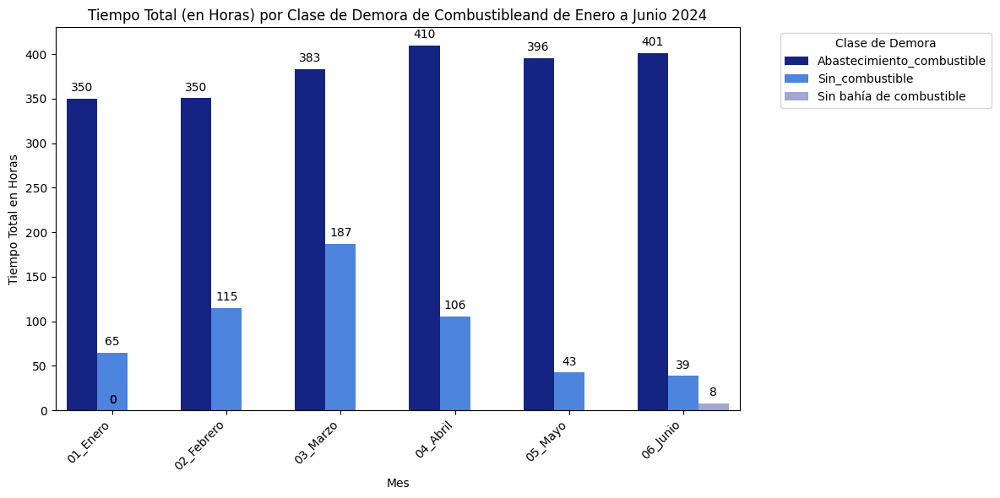

# Proyecto Data Science: "Analisis de mejoras en el proceso de abastecimiento de combustible de camiones mineros"
Proyecto desarrollado como entregable para el curso de "Data Scientist" de UDACITY

Hola Camilita

Para ingresar al Blog del proyecto se puede ingresar [aquí](https://medium.com/@iax.espv/evaluaci%C3%B3n-del-impacto-del-cambio-de-horario-en-el-abastecimiento-de-combustible-para-equipos-b0afc3bd322d).

## Tabla de Contenidos
1. [Instalación](#Instalación)
2. [Motivación del Proyecto](#Motivación-del-Proyecto)
3. [Descripción de Archivos](#Descripción-de-Archivos)
4. [Resultados](#Resultados)
5. [Licencia, Autores y Reconocimientos](#Licencia-Autores-y-Reconocimientos)

## Instalación
El código debería funcionar sin problemas utilizando versiones de Python 3.10.13
Las bibliotecas utilizadas son:
- pandas 2.2.2
- numpy 2.0.0
- matplotlib.pyplot 3.9.1
- seaborn 0.13.2
- datetime

## Motivación del Proyecto
Analizar la data de abastecimiento de combustible para determinar si el cambio de horario del personal que atiende el abastecimiento ha logrado mejoras a partir del mes de mayo del 2024 en los siguientes aspectos:

1. La cantidad horas en que le equipo tiene la demoras "sin combustible" ha disminuido?

2. El tiempo promedio x abastecimiento de combustible ha disminuido?

3. La cantidad de abastecimientos > a 25 minutos ha disminuido?

4. Existe aún una diferencia entre guardias relacionada a la cantidad en horas de la demora "sin combustible'?

## Descripción de Archivos
- El repositorio contiene un cuaderno llamado "grifo.ipynb" que muestra el análisis realizado. El cuaderno incluye celdas de markdown que explican el proceso de pensamiento detrás de cada paso.
- Adicionalmente en el repositorio cuenta con el archivo "demoras_combustible.xlsx" donde se encuentra la data analizada en el presente trabajo.

## Resultados
El cambio de horario implementado en mayo de 2024 ha tenido un impacto positivo en varios aspectos clave del proceso de abastecimiento de combustible para equipos pesados. Sin embargo, aún quedan áreas por mejorar, especialmente en la equidad entre guardias.

Los principales hallazgos del análisis se pueden encontrar en el artículo disponible [aquí](https://medium.com/@iax.espv/evaluaci%C3%B3n-del-impacto-del-cambio-de-horario-en-el-abastecimiento-de-combustible-para-equipos-b0afc3bd322d).
